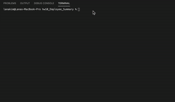
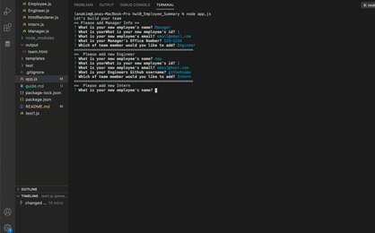
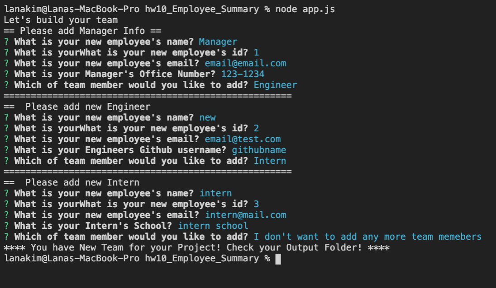
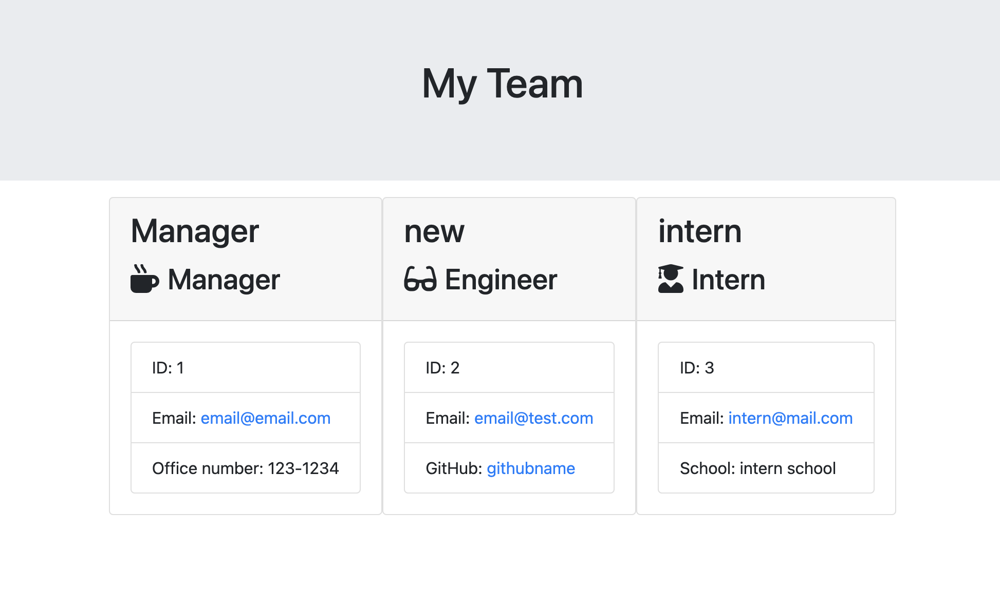

# HW10 Employee Summary

## Task

You task is to build a Node CLI that takes in information about employees and generates an HTML webpage that displays summaries for each person. Since testing is a key piece in making code maintainable, you will also be ensuring that all unit tests pass.

## Instructions

This is command-line application for building a software engineering team. It will prompt the user for information about the team manger first, then user can decide how to build the rest of team with engineers and interns. When the user has completed builing the team, this application will create an HTML file that display user's newly built software engineering team.

## Walkthrough Video

## Screenshot

## License

